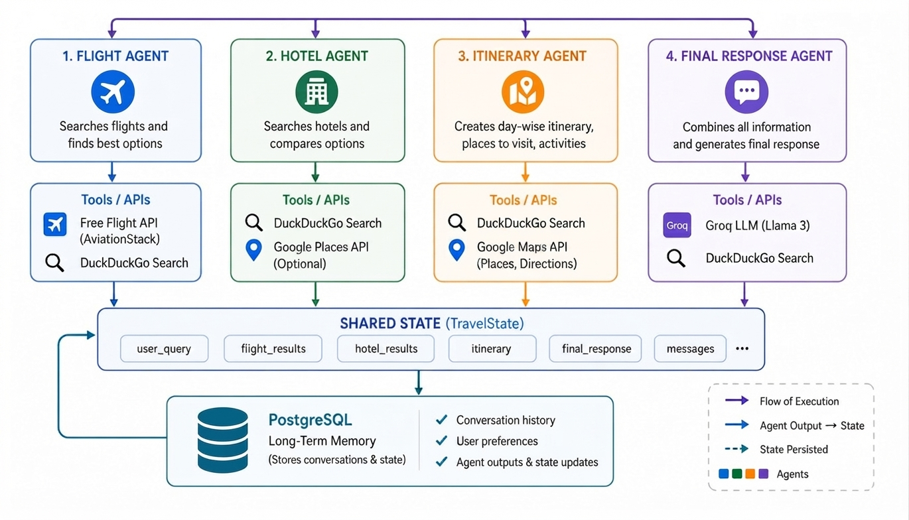
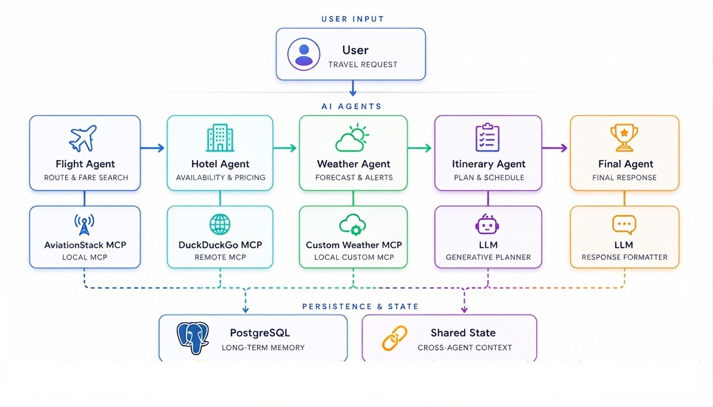

# ✈️ GuzoAI - multi-agent travel planner using MCP

This is the MCP-powered version of [GuzoAI](https://github.com/mebre7/GuzoAI). Compared to the original, tools are now exposed and consumed via the **Model Context Protocol (MCP)**, and a new **Weather Agent** has been added.

A multi-agent AI travel planner that takes natural language input and generates personalized travel itineraries — including flights, hotels, weather, activities, and local attractions.

Built with **LangGraph**, **LangChain**, **Groq**, and **FastAPI**.

## Architecture

### Without MCP (original)

### With MCP (this version)

Tools (flight search, web search, weather) are served as MCP servers and consumed by agents through the MCP client interface.

## Agents

| Agent | Role |
|---|---|
| Flight Agent | Finds live flight data based on route and travel dates using AviationStack API |
| Hotel Agent | Recommends accommodations based on budget and preferences via DuckDuckGo search |
| Weather Agent | Fetches weather forecasts for the destination to help plan activities |
| Itinerary Agent | Builds a day-by-day travel plan with activities and sightseeing |
| Final Response Agent | Compiles all agent outputs into a cohesive travel plan |

Each agent shares a common **State** stored in PostgreSQL, which acts as persistent memory across the session. State fields: `user_query`, `flight_results`, `hotel_results`, `itinerary`, `final_response`, `messages`.

## What Changed from the Non-MCP Version

- Tools (`flight_tool`, `search_tool`, weather tool) are now exposed as **MCP servers**
- Agents consume tools via the **MCP client** instead of direct function calls
- A new **Weather Agent** is included to provide destination weather context
- Tool logic is decoupled from agent logic, making it easier to swap or extend tools

## Tech Stack

- [LangGraph](https://github.com/langchain-ai/langgraph) — multi-agent workflow orchestration
- [LangChain + Groq](https://python.langchain.com/) — LLM integration
- [MCP (Model Context Protocol)](https://modelcontextprotocol.io/) — tool serving and consumption
- [AviationStack API](https://aviationstack.com/) — live flight data
- [DuckDuckGo Search](https://pypi.org/project/ddgs/) — web search tool
- [PostgreSQL](https://www.postgresql.org/) — persistent agent memory
- [FastAPI](https://fastapi.tiangolo.com/) — web server

## License

[MIT](LICENSE)
